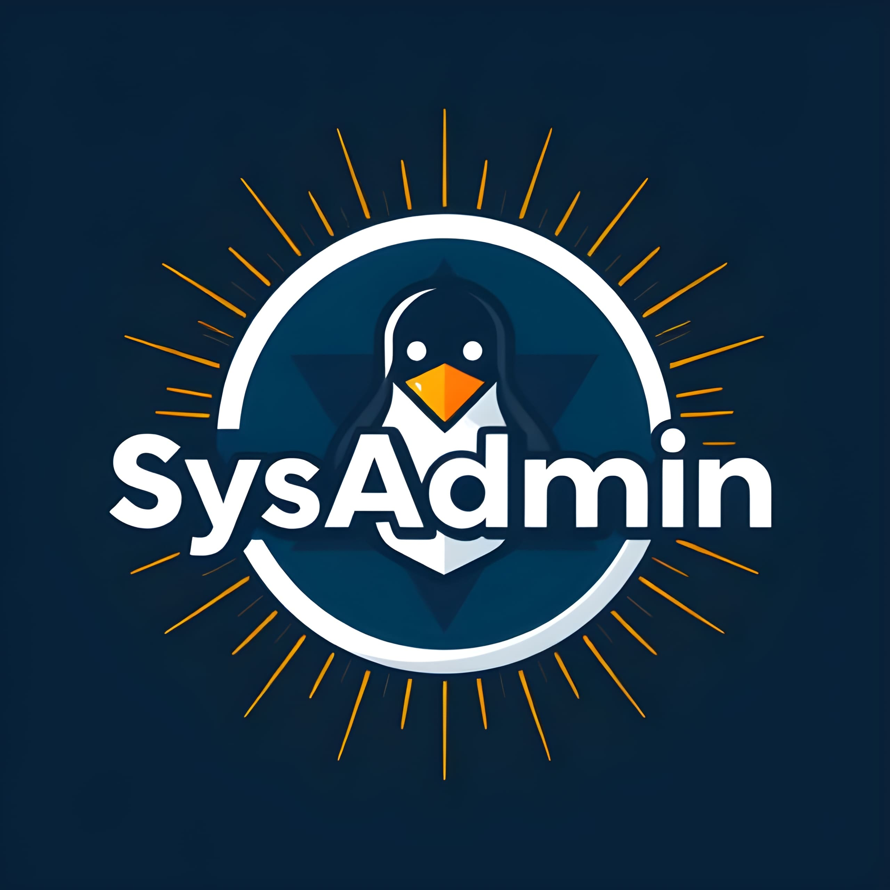

<a id="readme-top"></a>
<!-- PROJECT LOGO -->
<br />
<div align="center">
  <a href="https://github.com/ChocolateXmas/SysAdmin-CLI">
    
  </a>

  <h1 align="center">SysAdmin-CLI</h1>
  <h5 align="center">System Management</h5>

  <p align="center">
    A simple yet powerful Bash script for managing users, view system health, making backups and logs and much more on a Linux system.
    <br />
    <br />
    <a href="">View Demo</a>
    &middot;
    <a href="">Report Bug</a>
    &middot;
    <a href="">Request Feature</a>
  </p>
</div>

<!-- TABLE OF CONTENTS -->
<details>
  <summary>Table of Contents</summary>
  <ol>
    <li>
      <a href="#about-the-project">About The Project</a>
      <ul>
        <li><a href="#built-with">Built With</a></li>
      </ul>
    </li>
    <li>
      <a href="#getting-started">Getting Started</a>
      <ul>
        <li><a href="#prerequisites">Prerequisites</a></li>
        <li><a href="#installation">Installation</a></li>
      </ul>
    </li>
    <li><a href="#usage">Usage</a></li>
    <li><a href="#roadmap">Roadmap</a></li>
    <li><a href="#contributing">Contributing</a></li>
    <li><a href="#license">License</a></li>
    <li><a href="#contact">Contact</a></li>
    <li><a href="#acknowledgments">Acknowledgments</a></li>
  </ol>
</details>


<!-- ABOUT THE PROJECT -->
## About The Project

![Program Screenshot][program-screenshot]
<br/>
As part of my DevOps learning journey, I took the opportunity to develop a utility that simplifies system management while incorporating my own unique approach.
<br/>
This tool includes a range of essential features, from monitoring server health and managing users through an intuitive menu to performing backups and more. My goal was to create a comprehensive solution that streamlines system administration and enhances usability.

<p align="right">(<a href="#readme-top">back to top</a>)</p>

<!-- BUILT WITH -->
## Built With
* [![Bash Badge][bash-badge]][bash-url]

<p align="right">(<a href="#readme-top">back to top</a>)</p>

<!-- GETTING STARTED -->
## Getting Started
Ensure you are using a Linux terminal and have navigated to your desired directory.

<p align="right">(<a href="#readme-top">back to top</a>)</p>

<!-- PREREQUISITES -->
## ⚡ Prerequisites

Before using this utility, ensure your system meets the following requirements.

- ### 🖥️ System Requirements  
    - ✅ A **Linux** operating system (Ubuntu, Debian, Arch, etc.)  
    - ✅ A **Linux terminal** (Bash, Zsh, or Fish)

- ### 🔑 Required Permissions  
    - **Root** or **sudo** access (for system management tasks)  

- ### 📚 Basic Knowledge

    - 💡 Familiarity with Linux commands
    - 💡 Understanding of user and process management

- ### 🎓 Recommended Knowledge

    - 📖 Basic understanding of system administration
    - 📖 Working with shell scripting

### :information_source: Dependencies

| Required | Version |
| :---: | :---: |
| [![Bash Icon][bash-icon]][bash-url]Bash Shell | 4.3+ |
| ![Linux Icon][linux-icon]Linux/Unix | * |

<p align="right">(<a href="#readme-top">back to top</a>)</p>

<!-- INSTALLATION -->
## Installation

> [!NOTE]
> SU Permissions are needed to run this script!

Clone the repository, navigate to the directory, and execute the script:
1. Clone the repository:
```bash
git clone https://github.com/ChocolateXmas/SysAdmin-CLI.git
```
2. Navigate to the cloned directory:
```bash
cd SysAdmin-CLI
```
3. Run:
```bash
sudo ./sysadmin.sh
```
Follow the on-screen prompts to manage users.

## Features

- **List All Users**: Displays a list of all users with home directories.
- **Add New User**: Easily add a new user to the system.
- **Delete User**: Remove users from the system.
- **Modify User**: Update user properties (e.g., login name, display name, password, permissions).
- **Service Management**: Control associated services for users.

<p align="right">(<a href="#readme-top">back to top</a>)</p>

<!-- LICENSE -->
## License

This project is licensed under the MIT License. See the LICENSE file for more details.
⚡ Get Started with SysAdmin CLI Today!

[bash-badge]: https://img.shields.io/badge/bash-000000?style=for-the-badge&logo=gnubash&logoColor=#4EAA25
[bash-icon]: https://img.shields.io/badge/-000000?style=flat-square&logo=gnubash&logoColor=#4EAA25
[bash-url]: https://www.gnu.org/software/bash/
[linux-icon]: https://img.shields.io/badge/-000000?style=flat-square&logo=linux&logoColor=white
[program-screenshot]: images/Screenshot_from_program.png